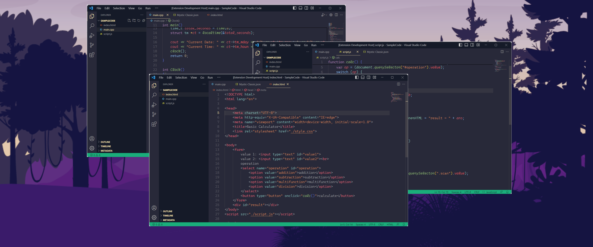

<h1 align="center"><br>
    
    <br><br> Mystic Theme
    <h5 align="center">A mysterious theme for proffesional.<h5><br>
    <h4 align="center">
    <a href="https://marketplace.visualstudio.com/items?itemName=AbrarShakhi.abrar-mystic-theme">Download for VScode</a>
    </h4><br></h1>
<br>

---

## Color

| scope      | hex-color |
| ---------- | --------- |
| comment    | #91a193   |
| function   | #a2cf82   |
| keyword    | #9ECBFF   |
| constant   | #d0bf96   |
| variable   | #E06C75   |
| storage    | #C39AC9   |
| string     | #e49760   |
| foreground | #91a193   |

<br>

---

## Theme Screenshot



> [Dracula wallpaper]

<br>

---

## Active theme

1. First `Install` the theme
2. Press `Ctrl+Shift+P` and search for `color theme` and hit `Enter`
3. look for `Mystic Theme` then hit `Enter`
4. ⭐⭐⭐⭐⭐ Rate five-stars 😃

<br>

---

## Tweaks & theming

Change color using `workbench.colorCustomizations ` to customize the theme. Example, Add this snippet in your `settings.json` file:

```json
"workbench.colorCustomizations": {
    "tab.activeBackground": "#f00",
    "activityBar.background": "#f00",
    "sideBar.background": "#f00",
}
```

> Replace `#f00` to your favorite hex color

or use the setting `editor.tokenColorCustomizations`

```json
"editor.tokenColorCustomizations": {
    "[Theme]": {
        "textMateRules": [
            {
                "scope": [
                    "comment"
                ],
                "settings": {
                    "foreground": "#f00"
                }
            }
        ]
    }
}
```

If you do not like the green color. paste the following color in `settings.json` then change the color.

```json
"workbench.colorCustomizations": {
    "tab.lastPinnedBorder": "#88e49d",
    "progressBar.background": "#88e49d",
    "activityBar.foreground": "#88e49d",
    "sideBarSectionHeader.foreground": "#88e49d",
    "editorSuggestWidget.highlightForeground": "#88e49d",
    "activityBar.activeBorder": "#88e49d",
    "activityBar.activeFocusBorder": "#88e49d",
    "editorBracketMatch.border": "#88e49d",
    "activityBarBadge.background": "#88e49d",
    "editorSuggestWidget.selectedIconForeground": "#88e49d",
    "badge.background": "#88e49d",
    "debugConsoleInputIcon.foreground": "#88e49d",
    "debugIcon.breakpointCurrentStackframeForeground": "#88e49d",
    "editorSuggestWidget.selectedForeground": "#88e49d",
    "debugTokenExpression.string": "#88e49d",
    "editorSuggestWidget.focusHighlightForeground": "#88e49d",
    "debugView.valueChangedHighlight": "#88e49d",
    "editor.findMatchBorder": "#88e49d",
    "editorLightBulb.foreground": "#88e49d",
    "extensionIcon.starForeground": "#88e49d",
    "list.activeSelectionForeground": "#88e49d",
    "list.inactiveSelectionForeground": "#88e49d",
    "editorCursor.foreground": "#88e49d",
    "menu.selectionForeground": "#88e49d",
    "minimapGutter.modifiedBackground": "#88e49d",
    "editorLineNumber.activeForeground": "#88e49d",
    "notificationLink.foreground": "#88e49d",
    "panelTitle.activeBorder": "#88e49d",
    "panelTitle.activeForeground": "#88e49d",
    "settings.headerForeground": "#88e49d",
    "settings.modifiedItemIndicator": "#88e49d",
    "symbolIcon.stringForeground": "#88e49d",
    "tab.activeBorder": "#88e49d",
    "tab.activeForeground": "#88e49d",
    "testing.runAction": "#88e49d",
    "editorGroup.border": "#88e49d",
    "textLink.foreground": "#88e49d",
    "button.background": "#88e49d",
    "button.hoverBackground": "#88e49daa",
    "list.activeSelectionBackground": "#88e49d3f",
    "editor.selectionBackground": "#88e49d1f",
    "minimap.selectionHighlight": "#88e49d1f",
    "scrollbarSlider.background": "#88e49d1f",
    "editorHoverWidget.border": "#88e49d15",
    "editorSuggestWidget.border": "#88e49d0f",
    "list.inactiveSelectionBackground": "#88e49d0f",
    "list.hoverBackground": "#88e49d0f",
    "editorGutter.addedBackground": "#88e49d",
    "statusBar.debuggingBackground": "#88e49d",
    "statusBarItem.remoteBackground": "#88e49d"
}
```

<br>

---

## Issues & Suggestions

For any issues or suggestions, please use [GitHub issues](https://github.com/AbrarShakhi/mystic-theme/issues).

<br>

---

### Suggest Editor Settings

```json
{
  "editor.fontFamily": "Cascadia Code Light",
  "editor.fontLigatures": "'calt', 'ss01'"
}
```
